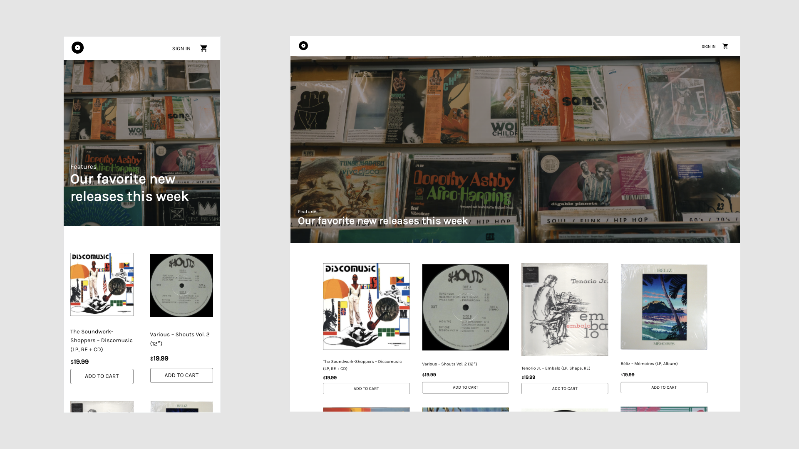

# Vinyl Record eCommerce Store

## Table of contents

- [Overview](#overview)
  - [Screenshot](#screenshot)
  - [Links](#links)
- [My process](#my-process)
  - [Built with](#built-with)
  - [Challenges](#challenges)
  - [What I learned](#what-i-learned)
  - [Continued development](#continued-development)
  - [Useful resources](#useful-resources)
- [Author](#author)

## Overview

An online vinyl record shop, allowing users the ability to browse through various vinyl records with full description and genre. Users will also be able to place products in a shopping cart, where it is presented as an order at checkout.

### Screenshot



### Links

- Live Site URL: [https://vinyl-record-store.herokuapp.com/](https://vinyl-record-store.herokuapp.com/)

## My process

### Built with

- React
- Redux
- MongoDB
- Node.js
- Express
- Material-UI

<!-- ### Challenges

After deploying to GitHub Pages, everything looked fine until I refreshed the page or navigated throught the browser. Whenever I clicked on a link or refreshed the page I would get a 404 error. -->

<!-- ### What I learned / Solution

```css

``` -->

<!-- ### Continued development

To develop this -->

### Useful resources

- [MERN eCommerce From Scratch ](https://www.udemy.com/course/mern-ecommerce/) - Udemy tutorial course explaining how to build an eCommerce platform with React, Redux, Express & MongoDB
- [User Authentication in Web Apps (Passport.js, Node, Express)](https://www.youtube.com/watch?v=F-sFp_AvHc8) - Freecodecamp tutorial explaining user authentication, cookies, sessions, and other accompanying middlewares for backend development.

## Author

- Website - [Andrés Roldán](https://www.andresroldan.com)
- LinkedIn - [Andrés Roldán](https://www.linkedin.com/in/andresroldan23/)
